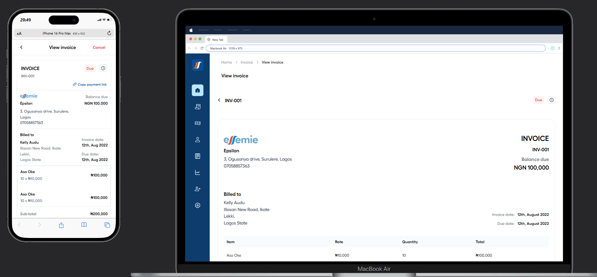

# Esemie View Invoice



## Overview

**Esemie View Invoice** is a React application that allows users to view their invoice history. This README provides a guide to the completed project, which features a fully responsive "View Invoice" page for the Esemie application.

## Objective

The goal was to create a **"View Invoice"** page that displays detailed invoice information, payment details, and payment history, with interactive actions for users.

## Prerequisites

Before you begin, ensure you have the following installed:

-   **[Node.js]** (version 14 or later)
-   **[npm]** (Node Package Manager, included with Node.js)

## Getting Started

Follow these steps to run the project locally:

### 1. Clone the Repository

Open your terminal and clone the repository using the following command:

```bash
git clone https://github.com/CJay-Cipher/Esemie_view_invoice_page.git
```

### 2. Navigate to the Project Directory

Change your directory to the React app folder:

```bash
cd Esemie_view_invoice_page/view_invoice
```

### 3. Install Dependencies

Install the required dependencies by running:

```bash
npm install
```

#### Dependencies

This project uses the following libraries:

**Dependencies**:

-   `@react-icons/all-files`: ^4.1.0
-   `react`: ^18.3.1
-   `react-dom`: ^18.3.1
-   `react-icons`: ^5.4.0
-   `zustand`: ^5.0.2

**Important DevDependencies**:

-   `@vitejs/plugin-react`: ^4.3.4
-   `eslint`: ^9.15.0
-   `tailwindcss`: ^3.4.16
-   `typescript`: ~5.6.2

### 4. Run the Development Server

Start the development server with the following command:

```bash
npm run dev
```

After a few moments, you should see output indicating that the server is running, typically at `http://localhost:5173`.

### 5. Open the Project in Your Browser

Open your web browser and go to `http://localhost:5173` to view the application.

## Responsiveness

The "View Invoice" page is fully responsive, adapting seamlessly to desktop, tablet, and mobile views.

## Code Quality

-   The project features clean, modular, and reusable React components.
-   TypeScript is used for strong type safety.
-   Best practices for accessibility have been followed (e.g., proper alt text, semantic HTML).
-   State management is implemented using Zustand.

## Styling

-   The application uses Tailwind CSS for styling, ensuring a modern and visually appealing interface.

## Deliverables

-   A fully functional React page implementing the design and functionality outlined above.
-   Instructions on how to run the project locally.
-   Documentation for any assumptions or additional features added.
